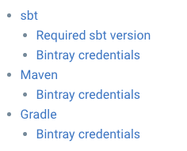

Organizing pages
----------------

The first header in a markdown page will become the title of this page, even if it's a smaller header than the others.

### @@@index container

`@@@index` is used to list child pages or sections from a page.
For example, your main `index.md` could contain something like this:

```
@@@ index

* [Setup](setup/index.md)
* [Usage](usage/index.md)

@@@
```

Inside `setup/index.md` can list its own child pages as follows:


```
@@@ index

* [sbt](sbt.md)
* [Maven](maven.md)
* [Gradle](gradle.md)

@@@
```

Paradox will walk through these indices and create a hierarchical navigation sidebar:


Similar to `@ref`, the source document on Github will link correctly the other sources.

### @@toc block

The "generic" theme already renders a hierarchical navigation sidebar,
but let's say you would like to render a more detailed table of contents for a section overview page.

The `@@toc` block is used to include a table of content with arbitrary depth.

```markdown
@@toc { depth=2 }
```

This will render the page names (first header), and the second headers.


