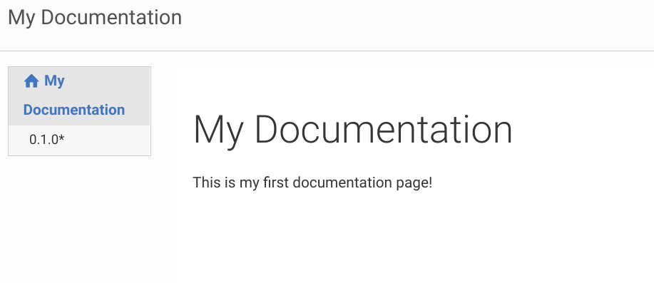

# Getting Started

This guide helps you to quickly setup an sbt project to use paradox and write your first documentation pages.  

### Setup

Create `project/paradox.sbt`:

@@@vars
```scala
addSbtPlugin("com.lightbend.paradox" % "sbt-paradox" % "$version$")
```
@@@

Inside `build.sbt`, add `ParadoxPlugin` to a subproject:

```scala
lazy val root = (project in file(".")).
  enablePlugins(ParadoxPlugin).
  settings(
    name := "Hello Project",
    paradoxTheme := Some(builtinParadoxTheme("generic"))
  )
```

### Writing docmentation

Create your first documentation page in `src/main/paradox/index.md` which is the entry page of your documentation site.

```
# My Documentation

This is my first documentation page!
``` 


### Generating documentation

Call `paradox` in sbt which will generate the site in `target/paradox/site/main`.

@@@note

You may want to use `~ show paradox` in sbt, which shows the absolute path where Paradox generated your
documentation and which will automatically regenerate documentation when you change a documentation file. 

@@@

Open `target/paradox/site/main/index.html` and admire the results!

